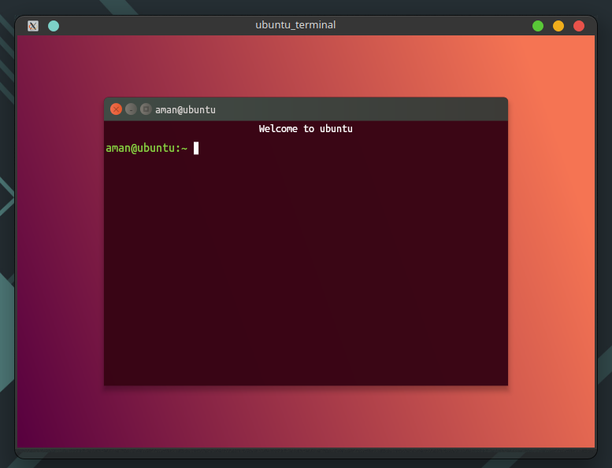

# ubuntu_terminal

This project is UI clone of Ubuntu terminal in Flutter.

# Preview


<br>

## To run the project:-
- Switch to **dev** channel of flutter using command: 

 ```
  flutter channel dev
  ```
- Run the app using:-
```
flutter run -d <your-desktop>
```